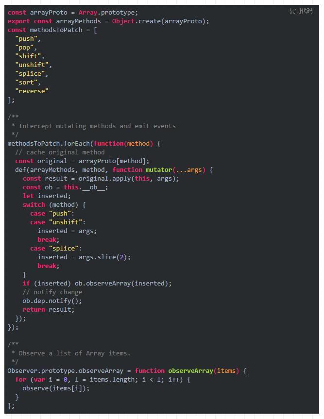

# Vue

## 1. Vue2.0的双向数据绑定原理是什么

展开查看答案

vue.js 是采用数据劫持结合发布者-订阅者模式的方式，通过Object.defineProperty()来劫持各个属性的setter，getter，在数据变动时发布消息给订阅者，触发相应的监听回调。

<pre>
//vue实现数据双向绑定的原理就是用Object.defineproperty()重新定义（set方法）对象设置属性值和（get方法）获取属性值的操纵来实现的。
//Object.property()方法的解释：Object.property(参数1，参数2，参数3)  返回值为该对象obj
//其中参数1为该对象（obj），参数2为要定义或修改的对象的属性名，参数3为属性描述符，属性描述符是一个对象，主要有两种形式：数据描述符和存取描述符。这两种对象只能选择一种使用，不能混合使用。而get和set属于存取描述符对象的属性。
//这个方法会直接在一个对象上定义一个新属性或者修改对象上的现有属性，并返回该对象。

&lt;!DOCTYPE html&gt;
&lt;html&gt;
&lt;head&gt;
    &lt;meta charset="utf-8"&gt;
&lt;/head&gt;
&lt;body&gt;
    &lt;div id="myapp"&gt;
        &lt;input v-model="message" /&gt;&lt;br&gt;
        &lt;span v-bind="message"&gt;&lt;/span&gt;
    &lt;/div&gt;
    &lt;script type="text/javascript"&gt;
        var model = {
            message: ""
        };
        var models = myapp.querySelectorAll("[v-model=message]");
        for (var i = 0; i < models.length; i++) {
            models[i].onkeyup = function() {
                model[this.getAttribute("v-model")] = this.value;
            }
        }
        // 观察者模式 / 钩子函数
        // defineProperty 来定义一个对象的某个属性
        Object.defineProperty(model, "message", {
            set: function(newValue) {
                var binds = myapp.querySelectorAll("[v-bind=message]");
                for (var i = 0; i < binds.length; i++) {
                    binds[i].innerHTML = newValue;
                };
                var models = myapp.querySelectorAll("[v-model=message]");
                for (var i = 0; i < models.length; i++) {
                    models[i].value = newValue;
                };
                this.value = newValue;
            },
            get: function() {
                return this.value;
            }
        })
    &lt;/script&gt;
&lt;/body&gt;
&lt;/html&gt;
</pre>

<em>Vue3.0将用原生Proxy替换Object.defineProperty</em> 
<b>为什么要替换Object.defineProperty？</b>
<ul>
    <li>在Vue中，Object.defineProperty无法监控到数组下标的变化，导致直接通过数组的下标给数组设置值，不能实时响应</li>
    <li>Object.defineProperty只能劫持对象的属性,因此我们需要对每个对象的每个属性进行遍历</li>
</ul>
<b>什么是Proxy</b>
<ul>
    <li>Proxy是 ES6 中新增的一个特性，翻译过来意思是"代理"，用在这里表示由它来“代理”某些操作。 Proxy 让我们能够以简洁易懂的方式控制外部对对象的访问。其功能非常类似于设计模式中的代理模式。</li>
    <li>Proxy 可以理解成，在目标对象之前架设一层“拦截”，外界对该对象的访问，都必须先通过这层拦截，因此提供了一种机制，可以对外界的访问进行过滤和改写。</li>
    <li>使用 Proxy 的核心优点是可以交由它来处理一些非核心逻辑（如：读取或设置对象的某些属性前记录日志；设置对象的某些属性值前，需要验证；某些属性的访问控制等）。 从而可以让对象只需关注于核心逻辑，达到关注点分离，降低对象复杂度等目的</li>
</ul>

## 2. vue生命周期

展开查看答案

<ul>
    <li>
        <b>beforeCreate(创建前)</b>
        
vue实例的挂载元素$el和数据对象 data都是undefined, 还未初始化

    </li>
    <li>
        <b>created(创建后)</b>
        
完成了 data数据初始化, el还未初始化

    </li>
    <li>
        <b>beforeMount(载入前)</b>
        
vue实例的$el和data都初始化了, 相关的render函数首次被调用

    </li>
    <li>
        <b>mounted(载入后)</b>
        
此过程中进行ajax交互

    </li>
    <li>
        <b>beforeUpdate(更新前)</b>
        

    </li>
    <li>
        <b>updated(更新后)</b>
        

    </li>
    <li>
        <b>beforeDestroy(销毁前)</b>
        

    </li>
    <li>
        <b>destroyed(销毁后)</b>
        

    </li>
</ul>

## 3. 组件data为什么返回函数

展开查看答案

<b>组件中的data写成一个函数，数据以函数返回值形式定义，这样每复用一次组件，就会返回一份新的data。如果单纯的写成对象形式，就使得所有组件实例共用了一份data，造成了数据污染</b>

## 4. vue-router 有哪几种导航钩子?

展开查看答案

<ol>
    <li>
        <em>全局导航钩子（跳转前进行判断拦截）</em>
        <ul>
            <li>router.beforeEach(to, from, next)</li>
            <li>router.beforeResolve(to, from, next)</li>
            <li>router.afterEach(to, from ,next)</li>
        </ul>
    </li>
    <li>
        <em>组件内钩子</em>
        <ul>
            <li>beforeRouteEnter</li>
            <li>beforeRouteUpdate</li>
            <li>beforeRouteLeave</li>
        </ul>
    </li>
    <li>
        <em>单独路由独享组件</em>
        <ul>
            <li>beforeEnter</li>
        </ul>
    </li>
</ol>

## 5. v-if 和 v-show区别

展开查看答案

v-if 是真正的条件渲染，因为它会确保在切换过程中条件块内的事件监听器和子组件适当地被销毁和重建；也是惰性的：如果在初始渲染时条件为假，则什么也不做——直到条件第一次变为真时，才会开始渲染条件块。

v-show 就简单得多——不管初始条件是什么，元素总是会被渲染，并且只是简单地基于 CSS 的 “display” 属性进行切换。

所以，v-if 适用于在运行时很少改变条件，不需要频繁切换条件的场景；v-show 则适用于需要非常频繁切换条件的场景。

## 6. v-model双向绑定原理

展开查看答案

<em>v-model本质上是语法糖，v-model 在内部为不同的输入元素使用不同的属性并抛出不同的事件</em> 
<ul>
    <li>text 和 textarea 元素使用 value 属性和 input 事件</li>
    <li>checkbox 和 radio 使用 checked 属性和 change 事件</li>
    <li>select 字段将 value 作为 prop 并将 change 作为事件</li>
</ul>

可以v-model进行如下改写：

<pre>
&lt;input v-model="sth" /&gt;
//  等同于
&lt;input :value="sth" @input="sth = $event.target.value" /&gt;
</pre>

这个语法糖必须是固定的，也就是说属性必须为value，方法名必须为：input

知道了v-model的原理，我们可以在自定义组件上实现v-model

<pre>
//Parent
&lt;template&gt;
    {{num}}
    &lt;Child v-model="num"&gt;
&lt;/template&gt;
export default {
    data(){
        return {
            num: 0
        }
    }
}

//Child
&lt;template&gt;
    &lt;div @click="add"&gt;Add</div&gt;
&lt;/template&gt;
export default {
    props: ['value'],
    methods:{
        add(){
            this.$emit('input', this.value + 1)
        }
    }
}
</pre>

## 7. key的作用

展开查看答案

<ol>
<li>

让vue精准的追踪到每一个元素，高效的更新虚拟DOM。

</li>
<li>
<em>触发过渡</em>
<pre>
&lt;transition&gt;
    &lt;span :key="text"&gt;{{ text }}&lt;/span&gt;
&lt;/transition&gt;
</pre>

当text改变时，这个元素的key属性就发生了改变，在渲染更新时，Vue会认为这里新产生了一个元素，而老的元素由于key不存在了，所以会被删除，从而触发了过渡。

</li>
</ol>

## 8. scoped属性作用

展开查看答案

在Vue文件中的style标签上有一个特殊的属性，scoped。当一个style标签拥有scoped属性时候，它的css样式只能用于当前的Vue组件，可以使组件的样式不相互污染。如果一个项目的所有style标签都加上了scoped属性，相当于实现了样式的模块化。

scoped属性的实现原理是给每一个dom元素添加了一个独一无二的动态属性，给css选择器额外添加一个对应的属性选择器，来选择组件中的dom。

<pre>
&lt;template&gt;
    &lt;div class="box"&gt;dom&lt;/div&gt;
&lt;/template&gt;
&lt;style lang="scss" scoped&gt;
.box{
    background:red;
}
&lt;/style&gt;

vue将代码转译成如下：

.box[data-v-11c6864c]{
    background:red;
}
&lt;template&gt;
    &lt;div class="box" data-v-11c6864c&gt;dom&lt;/div&gt;
&lt;/template&gt;

</pre>

## 9. scoped样式穿透

展开查看答案

scoped虽然避免了组件间样式污染，但是很多时候我们需要修改组件中的某个样式，但是又不想去除scoped属性。

<ol>
<li>
<em>使用/deep/</em>
<pre>
//Parent
&lt;template&gt;
&lt;div class="wrap"&gt;
    &lt;Child /&gt;
&lt;/div&gt;
&lt;/template&gt;

&lt;style lang="scss" scoped&gt;
.wrap /deep/ .box{
    background: red;
}
&lt;/style&gt;

//Child
&lt;template&gt;
    &lt;div class="box"&gt;&lt;/div&gt;
&lt;/template&gt;
</pre>
</li>
<li>
<em>使用两个style标签</em>
<pre>
//Parent
&lt;template&gt;
&lt;div class="wrap"&gt;
    &lt;Child /&gt;
&lt;/div&gt;
&lt;/template&gt;

&lt;style lang="scss" scoped&gt;
//其他样式
&lt;/style&gt;
&lt;style lang="scss"&gt;
.wrap .box{
    background: red;
}
&lt;/style&gt;

//Child
&lt;template&gt;
    &lt;div class="box"&gt;</div&gt;
&lt;/template&gt;
</pre>
</li>
</ol>

## 10. ref的作用

展开查看答案

<ol>
    <li>获取dom元素this.$refs.box</li>
    <li>获取子组件中的datathis.$refs.box.msg</li>
    <li>调用子组件中的方法this.$refs.box.open()</li>
</ol>

## 11. computed和watch区别

展开查看答案

<ol>
<li>
<em>当页面中有某些数据依赖其他数据进行变动的时候，可以使用计算属性computed。computed 的值有缓存</em>

运用场景：当我们需要进行数值计算,并且依赖于其它数据时,应该使用 computed,因为可以利用 computed 的缓存特性,避免每次获取值时,都要重新计算

<pre>
&lt;template&gt;{{fullName}}&lt;/template&gt;
export default {
    data(){
        return {
            firstName: 'xie',
            lastName: 'yu fei',
        }
    },
    computed:{
        fullName: function(){
            return this.firstName + ' ' + this.lastName
        }
    }
}
</pre>
</li>
<li>
<em>watch用于观察和监听页面上的vue实例，如果要在数据变化的同时进行异步操作或者是比较大的开销，那么watch为最佳选择。无缓存性</em>

运用场景：当我们需要在数据变化时执行异步或开销较大的操作时,应该使用 watch,使用 watch 选项允许我们执行异步操作 ( 访问一个 API ),限制我们执行该操作的频率,并在我们得到最终结果前,设置中间状态。这些都是计算属性无法做到的。

<pre>
&lt;template&gt;{{fullName}}&lt;/template&gt;
export default {
    data(){
        return {
            firstName: 'xie',
            lastName: 'xiao fei',
            fullName: 'xie xiao fei'
        }
    },
    watch:{
        firstName(val) {
            this.fullName = val + ' ' + this.lastName
        },
        lastName(val) {
            this.fullName = this.firstName + ' ' + val
        }
    }
}

</pre>
</li>
</ol>

## 12. vue路由有几种模式

展开查看答案

<ol>
    <li>
    <em>hash模式</em>
    
即地址栏URL中的#符号，它的特点在于：hash 虽然出现URL中，但不会被包含在HTTP请求中，对后端完全没有影响，不需要后台进行配置，因此改变hash不会重新加载页面。

    </li>
    <li>
    <em>history模式</em>
    

    利用了HTML5 History Interface 中新增的pushState() 和replaceState() 方法（需要特定浏览器支持）。history模式改变了路由地址，因为需要后台配置地址。
    

    </li>
</ol>

## 13. 组件之间的传值通信

展开查看答案

<ol>
    <li>父组件给子组件传值通过props</li>
    <li>子组件给父组件传值通过$emit触发回调</li>
    <li>兄弟组件通信，通过实例一个vue实例eventBus作为媒介，要相互通信的兄弟组件之中，都引入eventBus</li>
</ol>
<pre>
//main.js
import Vue from 'vue'
export const eventBus = new Vue()

//brother1.vue
import eventBus from '@/main.js'
export default{
	methods: {
	    toBus () {
	        eventBus.$emit('greet', 'hi brother')
	    }
	}
}

//brother2
import eventBus from '@/main.js'
export default{
    mounted(){
        eventBus.$on('greet', (msg)=>{
            this.msg = msg
        })
    }
}
</pre>

## 14. vuex

展开查看答案

是一个能方便vue实例及其组件传输数据的插件 方便传输数据，作为公共存储数据的一个库

<ul>
    <li>state: 状态中心</li>
    <li>mutations: 更改状态，同步的</li>
    <li>actions: 异步更改状态</li>
    <li>getters: 获取状态</li>
    <li>modules: 将state分成多个modules，便于管理</li>
</ul>

例子:

<ol>
    <li>State（公司的仓库）</li>
    <li>Getter（只能取出物品，包装一下，不能改变物品任何属性）</li>
    <li>Muitation（仓库管理员，只有他可以直接存储到仓库）</li>
    <li>Action（公司的物料采购员，负责从外面买东西和接货， 要往仓库存东西，告诉仓库管理员要存什么）</li>
    
非常要注意的地方：只要刷新或者退出浏览器，仓库清空。

</ol>

## 15. Vue 响应式原理

展开查看答案

<b>核心实现类</b>

Observer : 它的作用是给对象的属性添加 getter 和 setter，用于依赖收集和派发更新

Dep : 用于收集当前响应式对象的依赖关系,每个响应式对象包括子对象都拥有一个 Dep 实例（里面 subs 是 Watcher 实例数组）,当数据有变更时,会通过 dep.notify()通知各个 watcher。

Watcher : 观察者对象 , 实例分为渲染 watcher (render watcher),计算属性 watcher (computed watcher),侦听器 watcher（user watcher）三种

<b>Watcher 和 Dep 的关系</b>

watcher 中实例化了 dep 并向 dep.subs 中添加了订阅者,dep 通过 notify 遍历了 dep.subs 通知每个 watcher 更新。

<b>依赖收集</b>
<ol>
    <li>initState 时,对 computed 属性初始化时,触发 computed watcher 依赖收集</li>
    <li>initState 时,对侦听属性初始化时,触发 user watcher 依赖收集</li>
    <li>render()的过程,触发 render watcher 依赖收集</li>
    <li>re-render 时,vm.render()再次执行,会移除所有 subs 中的 watcer 的订阅,重新赋值。</li>
</ol>

<b>派发更新</b>
<ol>
    <li>组件中对响应的数据进行了修改,触发 setter 的逻辑</li>
    <li>调用 dep.notify()</li>
    <li>遍历所有的 subs（Watcher 实例）,调用每一个 watcher 的 update 方法</li>
</ol>

<b>原理</b>

当创建 Vue 实例时,vue 会遍历 data 选项的属性,利用 Object.defineProperty 为属性添加 getter 和 setter 对数据的读取进行劫持（getter 用来依赖收集,setter 用来派发更新）,并且在内部追踪依赖,在属性被访问和修改时通知变化。

每个组件实例会有相应的 watcher 实例,会在组件渲染的过程中记录依赖的所有数据属性（进行依赖收集,还有 computed watcher,user watcher 实例）,之后依赖项被改动时,setter 方法会通知依赖与此 data 的 watcher 实例重新计算（派发更新）,从而使它关联的组件重新渲染

<b>一句话总结</b>

vue.js 采用数据劫持结合发布-订阅模式,通过 Object.defineproperty 来劫持各个属性的 setter,getter,在数据变动时发布消息给订阅者,触发响应的监听回调

## 16. computed 的实现原理

展开查看答案

computed 本质是一个惰性求值的观察者。

computed 内部实现了一个惰性的 watcher,也就是 computed watcher,computed watcher 不会立刻求值,同时持有一个 dep 实例。

其内部通过 this.dirty 属性标记计算属性是否需要重新求值。

当 computed 的依赖状态发生改变时,就会通知这个惰性的 watcher,

computed watcher 通过 this.dep.subs.length 判断有没有订阅者,

有的话,会重新计算,然后对比新旧值,如果变化了,会重新渲染。 (Vue 想确保不仅仅是计算属性依赖的值发生变化，而是当计算属性最终计算的值发生变化时才会触发渲染 watcher 重新渲染，本质上是一种优化。)

没有的话,仅仅把 this.dirty = true。 (当计算属性依赖于其他数据时，属性并不会立即重新计算，只有之后其他地方需要读取属性的时候，它才会真正计算，即具备 lazy（懒计算）特性。)

## 17. 为什么在 Vue3.0 采用了 Proxy,抛弃了 Object.defineProperty？

展开查看答案

Object.defineProperty 本身有一定的监控到数组下标变化的能力,但是在 Vue 中,从性能/体验的性价比考虑,尤大大就弃用了这个特性(Vue 为什么不能检测数组变动 )。为了解决这个问题,经过 vue 内部处理后可以使用以下几种方法来监听数组

<pre>
push();
pop();
shift();
unshift();
splice();
sort();
reverse();
</pre>

由于只针对了以上 7 种方法进行了 hack 处理,所以其他数组的属性也是检测不到的,还是具有一定的局限性。

Object.defineProperty 只能劫持对象的属性,因此我们需要对每个对象的每个属性进行遍历。Vue 2.x 里,是通过 递归 + 遍历 data 对象来实现对数据的监控的,如果属性值也是对象那么需要深度遍历,显然如果能劫持一个完整的对象是才是更好的选择。  
  Proxy 可以劫持整个对象,并返回一个新的对象。Proxy 不仅可以代理对象,还可以代理数组。还可以代理动态增加的属性。

## 18. JS 运行机制

展开查看答案

JS 执行是单线程的，它是基于事件循环的。事件循环大致分为以下几个步骤:

<ol>
    <li>所有同步任务都在主线程上执行，形成一个执行栈（execution context stack）。</li>
    <li>主线程之外，还存在一个"任务队列"（task queue）。只要异步任务有了运行结果，就在"任务队列"之中放置一个事件。</li>
    <li>一旦"执行栈"中的所有同步任务执行完毕，系统就会读取"任务队列"，看看里面有哪些事件。那些对应的异步任务，于是结束等待状态，进入执行栈，开始执行。</li>
    <li>主线程不断重复上面的第三步。</li>
</ol>

主线程的执行过程就是一个 tick，而所有的异步结果都是通过 “任务队列” 来调度。 消息队列中存放的是一个个的任务（task）。 规范中规定 task 分为两大类，分别是 macro task 和 micro task，并且每个 macro task 结束后，都要清空所有的 micro task。

<pre>
for (macroTask of macroTaskQueue) {  
    // 1. Handle current MACRO-TASK  
    handleMacroTask();  
    // 2. Handle all MICRO-TASK  
    for (microTask of microTaskQueue) {
        handleMicroTask(microTask);  
    }
}
</pre>

在浏览器环境中

常见的 macro task 有 setTimeout、MessageChannel、postMessage、setImmediate 

常见的 micro task 有 MutationObsever 和 Promise.then 

## 19. 异步更新队列

展开查看答案

可能你还没有注意到，Vue 在更新 DOM 时是异步执行的。只要侦听到数据变化，Vue 将开启一个队列，并缓冲在同一事件循环中发生的所有数据变更。

如果同一个 watcher 被多次触发，只会被推入到队列中一次。这种在缓冲时去除重复数据对于避免不必要的计算和 DOM 操作是非常重要的。

然后，在下一个的事件循环“tick”中，Vue 刷新队列并执行实际 (已去重的) 工作。

Vue 在内部对异步队列尝试使用原生的 Promise.then、MutationObserver 和 setImmediate，如果执行环境不支持，则会采用 setTimeout(fn, 0) 代替。

## 20. vue 的 nextTick 方法的实现原理

展开查看答案

在 vue2.5 的源码中，macrotask 降级的方案依次是：setImmediate、MessageChannel、setTimeout

<ol>
    <li>vue 用异步队列的方式来控制 DOM 更新和 nextTick 回调先后执行</li>
    <li>microtask 因为其高优先级特性，能确保队列中的微任务在一次事件循环前被执行完毕</li>
    <li>考虑兼容问题,vue 做了 microtask 向 macrotask 的降级方案</li>
<ol>

## 21. vue 是如何对数组方法进行变异的

展开查看答案

简单来说,Vue 通过原型拦截的方式重写了数组的 7 个方法,首先获取到这个数组的ob,也就是它的 Observer 对象,如果有新的值,就调用 observeArray 对新的值进行监听,然后手动调用 notify,通知 render watcher,执行 update

## 22. 谈谈 Vue 事件机制,手写$on,$off,$emit,$once

展开查看答案

Vue 事件机制 本质上就是 一个 发布-订阅 模式的实现。

<pre>

</pre>

## 23. 说说 Vue 的渲染过程

展开查看答案

<ol>
    <li>调用 compile 函数,生成 render 函数字符串 ,编译过程如下:
    <ul>
        <li>parse 函数解析 template,生成 ast(抽象语法树)</li>
        <li>optimize 函数优化静态节点 (标记不需要每次都更新的内容,diff 算法会直接跳过静态节点,从而减少比较的过程,优化了 patch 的性能)</li>
        <li>generate 函数生成 render 函数字符串</li>
    </ul>
    </li>
    <li>调用 new Watcher 函数,监听数据的变化,当数据发生变化时，Render 函数执行生成 vnode 对象</li>
    <li>调用 patch 方法,对比新旧 vnode 对象,通过 DOM diff 算法,添加、修改、删除真正的 DOM 元素</li>
</ol>

## 24. 聊聊 keep-alive 的实现原理和缓存策略

展开查看答案

<pre>
</pre>
<ul>
    <li>获取 keep-alive 包裹着的第一个子组件对象及其组件名</li>
    <li>根据设定的 include/exclude（如果有）进行条件匹配,决定是否缓存。不匹配,直接返回组件实例</li>
    <li>根据组件 ID 和 tag 生成缓存 Key,并在缓存对象中查找是否已缓存过该组件实例。如果存在,直接取出缓存值并更新该 key 在 this.keys 中的位置(更新 key 的位置是实现 LRU 置换策略的关键)</li>
    <li>在 this.cache 对象中存储该组件实例并保存 key 值,之后检查缓存的实例数量是否超过 max 的设置值,超过则根据 LRU 置换策略删除最近最久未使用的实例（即是下标为 0 的那个 key）</li>
    <li>最后组件实例的 keepAlive 属性设置为 true,这个在渲染和执行被包裹组件的钩子函数会用到,这里不细说</li>
</ul>

## 25. LRU 缓存淘汰算法

展开查看答案

LRU（Least recently used）算法根据数据的历史访问记录来进行淘汰数据,其核心思想是“如果数据最近被访问过,那么将来被访问的几率也更高”。

keep-alive 的实现正是用到了 LRU 策略,将最近访问的组件 push 到 this.keys 最后面,this.keys[0]也就是最久没被访问的组件,当缓存实例超过 max 设置值,删除 this.keys[0]

## 26. vm.$set()实现原理是什么?

展开查看答案

受现代 JavaScript 的限制 (而且 Object.observe 也已经被废弃)，Vue 无法检测到对象属性的添加或删除

由于 Vue 会在初始化实例时对属性执行 getter/setter 转化，所以属性必须在 data 对象上存在才能让 Vue 将它转换为响应式的。

对于已经创建的实例，Vue 不允许动态添加根级别的响应式属性。但是，可以使用 Vue.set(object, propertyName, value) 方法向嵌套对象添加响应式属性。

那么 Vue 内部是如何解决对象新增属性不能响应的问题的呢?

<pre>

</pre>
<ol>
    <li>如果目标是数组,使用 vue 实现的变异方法 splice 实现响应式</li>
    <li>如果目标是对象,判断属性存在,即为响应式,直接赋值</li>
    <li>如果 target 本身就不是响应式,直接赋值</li>
    <li>如果属性不是响应式,则调用 defineReactive 方法进行响应式处理</li>
</ol>

## 27. 

展开查看答案

## 28. 

展开查看答案

