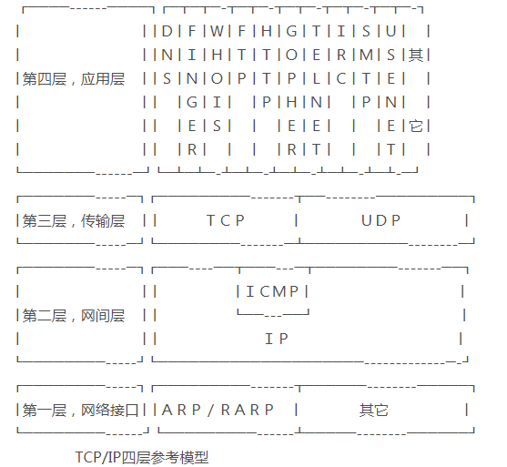

# OSI 模型

## 1. 查看 OSI 图片

展开查看答案

## 2. 各自业务

展开查看答案

<ul>
    <li>
        <b>物理层</b>
        
网卡，网线，集线器，中继器，调制解调器

    </li>
    <li>
        <b>数据链路层</b>
        
网桥，交换机

    </li>
    <li>
        <b>网络层</b>
        
路由器

    </li>
    <li>
        <b>传输层</b>
        

    </li>
    <li>
        <b>会话层</b>
        

    </li>
    <li>
        <b>表示层</b>
        

    </li>
    <li>
        <b>应用层</b>
        

    </li>
</ul>

## 一. 物理层

展开查看答案

<ul>
    <li>
        <em>功能</em>
        
底层数据传输

        
将数据的0、1转换为电压、脉冲光传输给物理的传输介质

    </li>
    <li>
        <em>概括</em>
        
比特流与电子信号之间的转换，使用物理介质传输

    </li>
    <li>
        <em>协议簇</em>
        
ISO2110，IEEE802，IEEE802.2，EIA/TIA RS-232、EIA/TIA RS-449、V.35、RJ-45

    </li>
    <li>
        <em>封装内容</em>
        
二进制流

        
比特流 也就是所谓电流

    </li>
    <li>
        <em>简述</em>
        
在OSI参考模型中，物理层（Physical Layer）是参考模型的最低层，也是OSI模型的第一层。
物理层的主要功能是：利用传输介质为数据链路层提供物理连接，实现比特流的透明传输。
物理层的作用是实现相邻计算机节点之间比特流的透明传送，尽可能屏蔽掉具体传输介质和物理设备的差异。使其上面的数据链路层不必考虑网络的具体传输介质是什么。“透明传送比特流”表示经实际电路传送后的比特流没有发生变化，对传送的比特流来说，这个电路好像是看不见的。

    </li>
</ul>

## 二. 数据链路层

展开查看答案

<ul>
    <li>
        <em>功能</em>
        
定义数据的基本格式，如何传输，如何标识

        
帧编码和误差纠正控制

    </li>
    <li>
        <em>概括</em>
        
数据帧和比特流之间的转换

    </li>
    <li>
        <em>协议簇</em>
        
SLIP，CSLIP，PPP，MTU，ARP，RARP，SDLC、HDLC、PPP、STP、帧中继

    </li>
    <li>
        <em>封装内容</em>
        
帧

    </li>
    <li>
        <em>简述</em>
        
数据链路层会将0、1序列划分为具有意义的数据帧传送给对端（数据帧的生成与接收）。举个例子可能会更好理解，暂且把需要传输的数据看作为不同来源的水，如果直接倒入池子中时，是无法重新分辨出不同来源的水的。但如果将不同来源的灌入瓶子中并打上记号，那就能区分出不同来源的水。这也就是为什么要划分为具有意义的数据帧传送给对端。同时要注意的是，数据链路层只负责将数据运送给物理相连的两端，并不负责直接发送到最终地址。

        

        数据链路层（Data Link Layer）是OSI模型的第二层，负责建立和管理节点间的链路。该层的主要功能是：通过各种控制协议，将有差错的物理信道变为无差错的、能可靠传输数据帧的数据链路。
在计算机网络中由于各种干扰的存在，物理链路是不可靠的。因此，这一层的主要功能是在物理层提供的比特流的基础上，通过差错控制、流量控制方法，使有差错的物理线路变为无差错的数据链路，即提供可靠的通过物理介质传输数据的方法。
该层通常又被分为介质访问控制（MAC）和逻辑链路控制（LLC）两个子层。

<ul>
    <li>MAC子层的主要任务是解决共享型网络中多用户对信道竞争的问题，完成网络介质的访问控制；</li>
    <li>LLC子层的主要任务是建立和维护网络连接，执行差错校验、流量控制和链路控制。</li>
</ul>
        
数据链路层的具体工作是接收来自物理层的位流形式的数据，并封装成帧，传送到上一层；同样，也将来自上层的数据帧，拆装为位流形式的数据转发到物理层；并且，还负责处理接收端发回的确认帧的信息，以便提供可靠的数据传输。

    </li>
</ul>

## 三. 网络层

展开查看答案

<ul>
    <li>
        <em>功能</em>
        
定义IP编址，定义路由功能

        
拥塞控制、网际互连

    </li>
    <li>
        <em>概括</em>
        
经由哪个路由传递给哪个目标地址

    </li>
    <li>
        <em>协议簇</em>
        
IP，ICMP，OSPF，BGP，IGMP，ARP，RARP，IPX、RIP、OSPF

    </li>
    <li>
        <em>封装内容</em>
        
数据报

    </li>
    <li>
        <em>简述</em>
        
网络层将数据从发送端的主机发送到接收端的主机，两台主机间可能会存在很多数据链路，但网络层就是负责找出一条相对顺畅的通路将数据传递过去。传输的地址使用的是IP地址。IP地址和我们的住址有点相似，我们的住址可以从省到市再到街逐步缩小范围，直至我们住址。IP地址也有这样的能力，通过不断转发到更近的IP地址，最终可以到达目标地址。

        
网络层（Network Layer）是OSI模型的第三层，它是OSI参考模型中最复杂的一层，也是通信子网的最高一层。它在下两层的基础上向资源子网提供服务。其主要任务是：通过路由选择算法，为报文或分组通过通信子网选择最适当的路径。该层控制数据链路层与传输层之间的信息转发，建立、维持和终止网络的连接。具体地说，数据链路层的数据在这一层被转换为数据包，然后通过路径选择、分段组合、顺序、进/出路由等控制，将信息从一个网络设备传送到另一个网络设备。

        
一般地，数据链路层是解决同一网络内节点之间的通信，而网络层主要解决不同子网间的通信。例如在广域网之间通信时，必然会遇到路由（即两节点间可能有多条路径）选择问题。 

        
在实现网络层功能时，需要解决的主要问题如下：

        <ul>
            <li>
            <b>寻址:</b>
            数据链路层中使用的物理地址（如MAC地址）仅解决网络内部的寻址问题。在不同子网之间通信时，为了识别和找到网络中的设备，每一子网中的设备都会被分配一个唯一的地址。由于各子网使用的物理技术可能不同，因此这个地址应当是逻辑地址（如IP地址）。
            </li>
            <li>
            <b>交换:</b>
            规定不同的信息交换方式。常见的交换技术有：线路交换技术和存储转发技术，后者又包括报文交换技术和分组交换技术。
            </li>
            <li>
            <b>路由算法:</b>
            当源节点和目的节点之间存在多条路径时，本层可以根据路由算法，通过网络为数据分组选择最佳路径，并将信息从最合适的路径由发送端传送到接收端。
            </li>
            <li>
            <b>连接服务:</b>
            与数据链路层流量控制不同的是，前者控制的是网络相邻节点间的流量，后者控制的是从源节点到目的节点间的流量。其目的在于防止阻塞，并进行差错检测。
            </li>
        </ul>
    </li>
</ul>

## 四. 传输层

展开查看答案

<ul>
    <li>
        <em>功能</em>
        
端到端传输数据的基本功能

        
管理两个节点之间的数据传输

    </li>
    <li>
        <em>概括</em>
        
是否有数据丢失

    </li>
    <li>
        <em>协议簇</em>
        
TCP，UDP

    </li>
    <li>
        <em>封装内容</em>
        
报文段

    </li>
    <li>
        <em>简述</em>
        
OSI下3层的主要任务是数据通信，上3层的任务是数据处理。而传输层（Transport Layer）是OSI模型的第4层。因此该层是通信子网和资源子网的接口和桥梁，起到承上启下的作用。

        
该层的主要任务是：向用户提供可靠的端到端的差错和流量控制，保证报文的正确传输。传输层的作用是向高层屏蔽下层数据通信的细节，即向用户透明地传送报文。该层常见的协议：TCP/IP中的TCP协议、Novell网络中的SPX协议和微软的NetBIOS/NetBEUI协议。
传输层提供会话层和网络层之间的传输服务，这种服务从会话层获得数据，并在必要时，对数据进行分割。然后，传输层将数据传递到网络层，并确保数据能正确无误地传送到网络层。因此，传输层负责提供两节点之间数据的可靠传送，当两节点的联系确定之后，传输层则负责监督工作。综上，传输层的主要功能如下：

<ul>
    <li>
    <b>传输连接管理</b>
    提供建立、维护和拆除传输连接的功能。传输层在网络层的基础上为高层提供“面向连接”和“面向无接连”的两种服务。
    </li>
    <li>
    <b>处理传输差错</b>
    提供可靠的“面向连接”和不太可靠的“面向无连接”的数据传输服务、差错控制和流量控制。在提供“面向连接”服务时，通过这一层传输的数据将由目标设备确认，如果在指定的时间内未收到确认信息，数据将被重发。
    </li>
</ul>
    </li>
</ul>

## 五. 会话层

展开查看答案

<ul>
    <li>
        <em>功能</em>
        
控制应用程序之间会话能力

        
建立、管理和维护通信

    </li>
    <li>
        <em>概括</em>
        
何时建立连接、何时断开连接以及保持多久连接

    </li>
    <li>
        <em>协议簇</em>
        
NetBIOS、ZIP

    </li>
    <li>
        <em>封装内容</em>
        

    </li>
    <li>
        <em>简述</em>
        
会话层(Session)是建立在传输层之上，利用传输层提供的服务，使应用建立和维持会话，并能使会话获得同步。
⑴为会话实体间建立连接
为给两个对等会话服务用户建立一个会话连接,应该做如下几项工作.
① 将会话地址映射为运输地址.
② 选择需要的运输服务质量参数(QOS).
③ 对会话参数进行协商.
④ 识别各个会话连接.
⑤ 传送有限的透明用户数据.
⑵数据传输阶段‘
这个阶段是在两个会话用户之间实现有组织的,同步的数据传输.用户数据单元为SSDU,而协议数据单元为SPDU.会话用户之间的数据传送过程是将SSDU转变成SPDU进行的.
⑶连接释放
连接释放是通过"有序释放","废弃"，"有限量透明用户数据传送"等功能单元来释放会话连接的。

        
会话层（Session Layer）是OSI模型的第5层，是用户应用程序和网络之间的接口，主要任务是：向两个实体的表示层提供建立和使用连接的方法。将不同实体之间的表示层的连接称为会话。因此会话层的任务就是组织和协调两个会话进程之间的通信，并对数据交换进行管理。

        
用户可以按照半双工、单工和全双工的方式建立会话。当建立会话时，用户必须提供他们想要连接的远程地址。而这些地址与MAC（介质访问控制子层）地址或网络层的逻辑地址不同，它们是为用户专门设计的，更便于用户记忆。域名（DN）就是一种网络上使用的远程地址例如：www.3721.com就是一个域名。会话层的具体功能如下:

        <ul>
            <li>
            <b>会话管理:</b>
            允许用户在两个实体设备之间建立、维持和终止会话，并支持它们之间的数据交换。例如提供单方向会话或双向同时会话，并管理会话中的发送顺序，以及会话所占用时间的长短。
            </li>
            <li>
            <b>会话流量控制:</b>
            提供会话流量控制和交叉会话功能。
            </li>
            <li>
            <b>寻址:</b>
            使用远程地址建立会话连接。
            </li>
            <li>
            <b>出错控制:</b>
            从逻辑上讲会话层主要负责数据交换的建立、保持和终止，但实际的工作却是接收来自传输层的数据，并负责纠正错误。会话控制和远程过程调用均属于这一层的功能。但应注意，此层检查的错误不是通信介质的错误，而是磁盘空间、打印机缺纸等类型的高级错误。
            </li>
        </ul>
    </li>
</ul>

## 六. 表示层

展开查看答案

<ul>
    <li>
        <em>功能</em>
        
数据格式化、代码转换、数据加密

    </li>
    <li>
        <em>概括</em>
        
接收不同数据格式图片、文本、视频、声音流转换成网络数据标准格式

    </li>
    <li>
        <em>协议簇</em>
        
ASCII、ASN.1、JPEG、MPEG

    </li>
    <li>
        <em>封装内容</em>
        

    </li>
    <li>
        <em>简述</em>
        
表示层位于OSI分层结构的第六层，它的主要作用之一是为异种机通信提供一种公共语言，以便能进行互操作。这种类型的服务之所以需要，是因为不同的计算机体系结构使用的数据表示法不同。与第五层提供透明的数据运输不同，表示层是处理所有与数据表示及运输有关的问题，包括转换、加密和压缩。
在表示层，数据将按照网络能理解的方案进行格式化；这种格式化也因所使用网络的类型不同而不同。表示层管理数据的解密与加密，如系统口令的处理如果在Internet上查询你银行账户，使用的即是一种安全连接。你的账户数据在发送前被加密，在网络的另一端，表示层将对接收到的数据解密。除此之外，表示层协议还对图片和文件格式信息进行解码和编码。
加密分为链路加密和端到端的加密。对于表示层，参与的加密属于端到端的加密，指信息由发送端自动加密，并进入TCP/IP数据包封装，然后作为不可阅读和不可识别的数据进入互联网。到达目的地后，再自动充足解密，成为可读数据。端到端加密面向网络高层主体，不对下层协议进行信息加密，协议信息以明文进行传送，用户数据在中央节点不需解密。

        
表示层（Presentation Layer）是OSI模型的第六层，它对来自应用层的命令和数据进行解释，对各种语法赋予相应的含义，并按照一定的格式传送给会话层。其主要功能是“处理用户信息的表示问题，如编码、数据格式转换和加密解密”等。表示层的具体功能如下：
数据格式处理：协商和建立数据交换的格式，解决各应用程序之间在数据格式表示上的差异。

<ul>
    <li>
    <b>数据的编码:</b>
    处理字符集和数字的转换。例如由于用户程序中的数据类型（整型或实型、有符号或无符号等）、用户标识等都可以有不同的表示方式，因此，在设备之间需要具有在不同字符集或格式之间转换的功能。
    </li>
    <li>
    <b>压缩和解压缩:</b>
    为了减少数据的传输量，这一层还负责数据的压缩与恢复。
    </li>
    <li>
    <b>数据的加密和解密:</b>
    可以提高网络的安全性
    </li>
</ul>
    </li>
</ul>

## 七. 应用层

展开查看答案

<ul>
    <li>
        <em>功能</em>
        
各种应用软件，包括 Web 应用

        
针对特定应用的协议

        
文件传输、电子邮件...

    </li>
    <li>
        <em>概括</em>
        

        电子邮件 <===> 电子邮件协议 
        远程传输 <===> 远程传输协议 
        文件传输 <===> 文件传输协议 
        

    </li>
    <li>
        <em>协议簇</em>
        

        TFTP，HTTP，SNMP，FTP，SMTP，DNS，RIP，Telnet
        

    </li>
    <li>
        <em>封装内容</em>
        
报文

    </li>
    <li>
        <em>简述</em>
        

        网络应用层是通信用户之间的窗口，为用户提供网络管理、文件传输、事务处理等服务。其中包含了若干个独立的、用户通用的服务协议模块。网络应用层是OSI的最高层，为网络用户之间的通信提供专用的程序。应用层的内容主要取决于用户的各自需要，这一层设计的主要问题是分布数据库、分布计算技术、网络操作系统和分布操作系统、远程文件传输、电子邮件、终端电话及远程作业登录与控制等。
        

        

        应用层（Application Layer）是OSI参考模型的最高层，它是计算机用户，以及各种应用程序和网络之间的接口，其功能是直接向用户提供服务，完成用户希望在网络上完成的各种工作。它在其他6层工作的基础上，负责完成网络中应用程序与网络操作系统之间的联系，建立与结束使用者之间的联系，并完成网络用户提出的各种网络服务及应用所需的监督、管理和服务等各种协议。此外，该层还负责协调各个应用程序间的工作。
        

        

应用层为用户提供的服务和协议有：文件服务、目录服务、文件传输服务（FTP）、远程登录服务（Telnet）、电子邮件服务（E-mail）、打印服务、安全服务、网络管理服务、数据库服务等。上述的各种网络服务由该层的不同应用协议和程序完成，不同的网络操作系统之间在功能、界面、实现技术、对硬件的支持、安全可靠性以及具有的各种应用程序接口等各个方面的差异是很大的
        

        

            应用层的主要功能如下：
        

        <ul>
            <li>
                <b>用户接口:</b>
                应用层是用户与网络，以及应用程序与网络间的直接接口，使得用户能够与网络进行交互式联系。
            </li>
            <li>
                <b>实现各种服务:</b>
                该层具有的各种应用程序可以完成和实现用户请求的各种服务。    
            </li>
        </ul>
    </li>
</ul>

## 3. 小结

展开查看答案

    由于OSI是一个理想的模型，因此一般网络系统只涉及其中的几层，很少有系统能够具有所有的7层，并完全遵循它的规定。
在7层模型中，每一层都提供一个特殊的网络功能。从网络功能的角度观察：

<ul>
    <li>下面4层（物理层、数据链路层、网络层和传输层）主要提供数据传输和交换功能，即以节点到节点之间的通信为主；</li>
    <li>第4层作为上下两部分的桥梁，是整个网络体系结构中最关键的部分；</li>
    <li>而上3层（会话层、表示层和应用层）则以提供用户与应用程序之间的信息和数据处理功能为主</li>
    <li>简言之，下4层主要完成通信子网的功能，上3层主要完成资源子网的功能。</li>
</ul>

## 4. TCP/IP分层模型

展开查看答案

TCP/IP协议被组织成四个概念层，其中有三层对应于ISO参考模型中的相应层。ICP/IP协议族并不包含物理层和数据链路层，因此它不能独立完成整个计算机网络系统的功能，必须与许多其他的协议协同工作

<ul>
    <li>
        <b>第一层:网络接口层</b>
        
包括用于协作IP数据在已有网络介质上传输的协议。实际上TCP/IP标准并不定义与ISO数据链路层和物理层相对应的功能。相反，它定义像地址解析协议(Address Resolution Protocol,ARP)这样的协议，提供TCP/IP协议的数据结构和实际物理硬件之间的接口。

    </li>
    <li>
        <b>第二层:网间层</b>
        
对应于OSI七层参考模型的网络层。本层包含IP协议、RIP协议(Routing Information Protocol，路由信息协议)，负责数据的包装、寻址和路由。同时还包含网间控制报文协议(Internet Control Message Protocol,ICMP)用来提供网络诊断信息。

    </li>
    <li>
        <b>第三层:传输层</b>
        
对应于OSI七层参考模型的传输层，它提供两种端到端的通信服务。其中TCP协议(Transmission Control Protocol)提供可靠的数据流运输服务，UDP协议(Use Datagram Protocol)提供不可靠的用户数据报服务。

    </li>
    <li>
        <b>第四层:应用层</b>
        
对应于OSI七层参考模型的应用层和表达层。因特网的应用层协议包括Finger、Whois、FTP(文件传输协议)、Gopher、HTTP(超文本传输协议)、Telent(远程终端协议)、SMTP(简单邮件传送协议)、IRC(因特网中继会话)、NNTP（网络新闻传输协议）等，这也是本书将要讨论的重点。

    </li>
</ul>

## 5. 

展开查看答案

